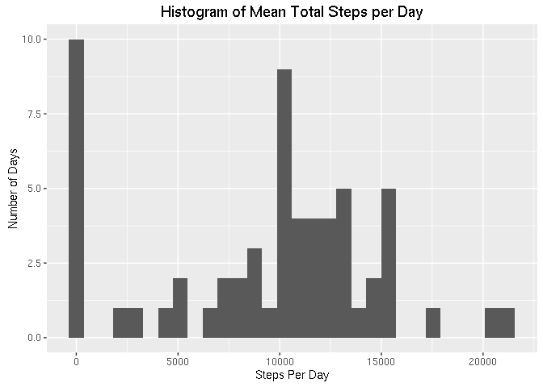
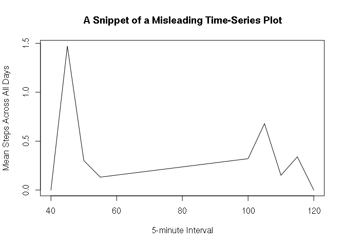
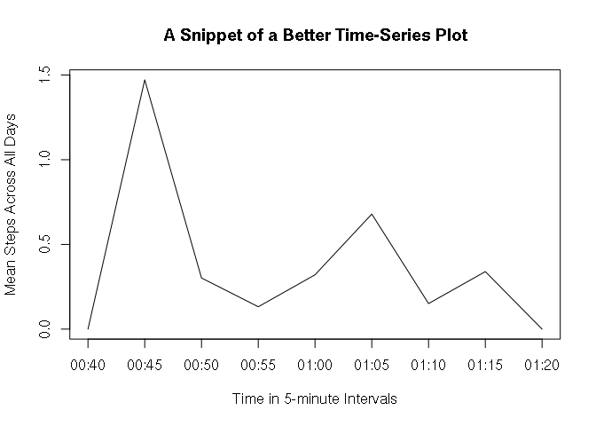
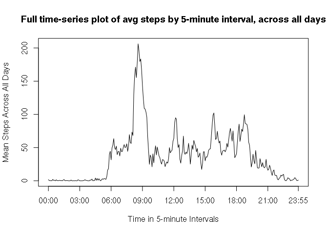
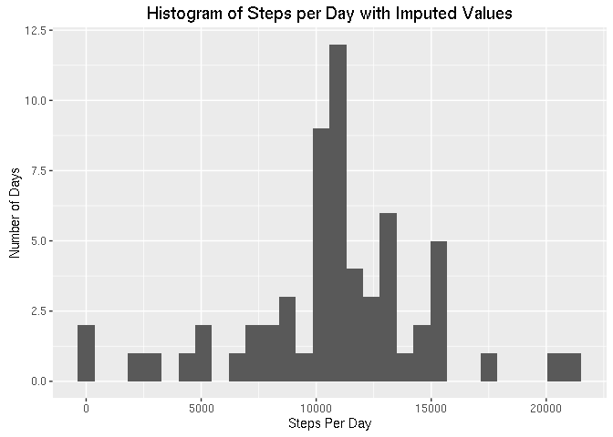
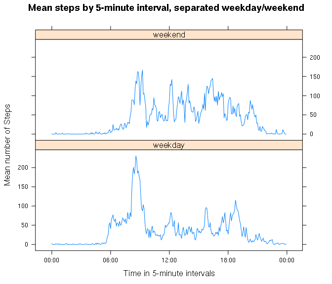

# Reproducible Research: Peer Assessment 1
Adam J Heller (aj@drfloob.com; [drfloob.com](http://drfloob.com))  
May 5th, 2016  


## Loading and preprocessing the data


```r
library(knitr)
library(dplyr)
knitr::opts_chunk$set(echo = TRUE)
```


```r
if (!file.exists("activity.csv")) {
    unzip(zipfile = "activity.zip")
}

activity <- read.csv(file = "activity.csv", header = TRUE, na.strings = "NA", stringsAsFactors = FALSE)
activity$date <- as.POSIXct(strptime(activity$date, format="%Y-%m-%d"))
```

## What is mean total number of steps taken per day?

**1) Calculate the total number of steps taken per day.**


```r
aspd <- activity %>% group_by(date) %>% summarize(stepsPerDay = sum(steps, na.rm=TRUE))
print(aspd)
```

```
## Source: local data frame [61 x 2]
## 
##          date stepsPerDay
##        (time)       (int)
## 1  2012-10-01           0
## 2  2012-10-02         126
## 3  2012-10-03       11352
## 4  2012-10-04       12116
## 5  2012-10-05       13294
## 6  2012-10-06       15420
## 7  2012-10-07       11015
## 8  2012-10-08           0
## 9  2012-10-09       12811
## 10 2012-10-10        9900
## ..        ...         ...
```

**2) If you do not understand the difference between a histogram and a barplot, research the difference between them. Make a histogram of the total number of steps taken each day.**

In a barplot, bars represent categories, while in histograms, bars represent finite ranges of values along a continuous variable. I appreciate [this explanation](http://shodor.org/interactivate/discussions/HistogramsVsBarGraph/). An example of a barplot for this data would be a plot of "days the individual walked" and "days the individual didn't walk". You could arrange these two bars in any order along the x-axis, and the y-axis would count the days.

In this histogram, the bars represent fixed ranges of steps per day, and the height of the bar is determined by how many days fall into each range.


```r
library(ggplot2)
qplot(data=aspd, stepsPerDay, bins=30,
      xlab = "Steps Per Day", 
      ylab = "Number of Days",
      main = "Histogram of Mean Total Steps per Day")
```



**3) Calculate and report the mean and median of the total number of steps taken per day**


```r
filter(aspd, !is.na(stepsPerDay)) %>% 
           summarize(mean(stepsPerDay), median(stepsPerDay))
```

```
## Source: local data frame [1 x 2]
## 
##   mean(stepsPerDay) median(stepsPerDay)
##               (dbl)               (int)
## 1           9354.23               10395
```


## What is the average daily activity pattern?

**1) Make a time series plot (i.e. type = "l") of the 5-minute interval (x-axis) and the average number of steps taken, averaged across all days (y-axis)**

The intervals are a bit misleading! They look like integral values, but they are coded identifiers that don't measure time linearly. For example, the values jump from "55" to "100" when the difference between these two observations is only 5 minutes. If you use these values in your time-series plot, you'll see large horizontal jumps at the end of every hour. For example:


```r
avg5 <- activity %>% group_by(interval) %>% summarize(meanSteps = mean(steps, na.rm = TRUE))
avg5 <- filter(avg5, interval >= 40 & interval <= 120)
plot(x=avg5$interval, y=avg5$meanSteps, type="l", 
     xlab = "5-minute Interval", 
     ylab="Mean Steps Across All Days", 
     main = "A Snippet of a Misleading Time-Series Plot")
```



Notice the large horizontal jump between 55 and 100?  To account for this, I recoded the interval values into true date-time values, which can be translated back into the original identifiers if need be.


```r
toTime <- function(x) {
    m <- x %% 100
    h <- x %/% 100
    sprintf("%.2d:%.2d", h, m)
}
avg5 <- activity %>% group_by(interval) %>% summarize(meanSteps = mean(steps, na.rm = TRUE))
avg5$interval <- as.POSIXct(strptime(lapply(avg5$interval, toTime), "%H:%M"))

goodAvg5 <- filter(avg5, interval >= strptime("00:40", "%H:%M") & interval <= strptime("01:20", "%H:%M"))

plot(x=goodAvg5$interval, y=goodAvg5$meanSteps, type="l", xaxt="n", 
     xlab = "Time in 5-minute Intervals", 
     ylab="Mean Steps Across All Days", 
     main="A Snippet of a Better Time-Series Plot")
axis(1, goodAvg5$interval, format(goodAvg5$interval, "%H:%M"))
```



This plot snippet above covers the same time range as the misleading plot before it, but without the misleading leap. Below is the full time-series plot. 


```r
plot(x=avg5$interval, y=avg5$meanSteps, type="l", xaxt="n",
     xlab = "Time in 5-minute Intervals", 
     ylab="Mean Steps Across All Days", 
     main="Full time-series plot of avg steps by 5-minute interval, across all days")
at <- c(pretty(avg5$interval, n=6), max(avg5$interval))
axis(1, at=at, labels=format(at, "%H:%M"))
```



**2) Which 5-minute interval, on average across all the days in the dataset, contains the maximum number of steps?**


```r
avg5[which.max(avg5$meanSteps),]
```

```
## Source: local data frame [1 x 2]
## 
##              interval meanSteps
##                (time)     (dbl)
## 1 2016-05-05 08:35:00  206.1698
```

## Imputing missing values


**1) Calculate and report the total number of missing values in the dataset (i.e. the total number of rows with NAs)**


```r
sum(is.na(activity$steps))
```

```
## [1] 2304
```

**2) Devise a strategy for filling in all of the missing values in the dataset. The strategy does not need to be sophisticated. For example, you could use the mean/median for that day, or the mean for that 5-minute interval, etc.**

I will use the rounded mean for the 5-minute interval across all days. If you'll recall the work above for the average daily activity pattern, the interval means were calculated with NAs stripped. I think this will be a fine estimate for actual values.

To do this, I'll filter the dataset down to just observations with missing values, fill in the missing values with results from the previously-created `avg5` dataset by interval, and merge this resulting dataset back with the original observations that were not missing values.

**3) Create a new dataset that is equal to the original dataset but with the missing data filled in.**


```r
nas <- filter(activity, is.na(steps))
nas$intervalct <- as.POSIXct(strptime(toTime(nas$interval), "%H:%M"))
nas <- merge(nas, avg5, by.x = "intervalct", by.y= "interval")
nas <- select(nas, steps=meanSteps, date, interval)
nas$steps <- round(nas$steps)
imputed <- rbind(nas, filter(activity, !is.na(steps))) %>% arrange(date, interval)
str(imputed)
```

```
## 'data.frame':	17568 obs. of  3 variables:
##  $ steps   : num  2 0 0 0 0 2 1 1 0 1 ...
##  $ date    : POSIXct, format: "2012-10-01" "2012-10-01" ...
##  $ interval: int  0 5 10 15 20 25 30 35 40 45 ...
```

```r
head(imputed)
```

```
##   steps       date interval
## 1     2 2012-10-01        0
## 2     0 2012-10-01        5
## 3     0 2012-10-01       10
## 4     0 2012-10-01       15
## 5     0 2012-10-01       20
## 6     2 2012-10-01       25
```

**4) Make a histogram of the total number of steps taken each day and Calculate and report the mean and median total number of steps taken per day. Do these values differ from the estimates from the first part of the assignment? What is the impact of imputing missing data on the estimates of the total daily number of steps?**


```r
aspd <- imputed %>% group_by(date) %>% summarize(stepsPerDay = sum(steps, na.rm=TRUE))
qplot(data=aspd, stepsPerDay, bins=30,
      xlab = "Steps Per Day", 
      ylab = "Number of Days", 
      main="Histogram of Steps per Day with Imputed Values")
```



```r
summarise(aspd, mean(stepsPerDay), median(stepsPerDay))
```

```
## Source: local data frame [1 x 2]
## 
##   mean(stepsPerDay) median(stepsPerDay)
##               (dbl)               (dbl)
## 1          10765.64               10762
```

These values expectedly differ from the estimates created in the first part of the assignment. Previously, the mean total steps per day was skewed downwards due to the missing values being treated as `0`s, which pulled the mean lower than the median. 

Imputing the missing values with the mean steps by interval brings the total mean value back up. This new mean is now much closer to the median estimate than before. 

## Are there differences in activity patterns between weekdays and weekends?

**1) Create a new factor variable in the dataset with two levels – “weekday” and “weekend” indicating whether a given date is a weekday or weekend day.**


```r
wkd <- mutate(imputed, weekday=ifelse(weekdays(date) %in% c("Saturday", "Sunday"), "weekend", "weekday"))
wkd$weekday <- as.factor(wkd$weekday)
```

**2) Make a panel plot containing a time series plot (i.e. type = "l") of the 5-minute interval (x-axis) and the average number of steps taken, averaged across all weekday days or weekend days (y-axis).**


```r
wkd.avg5 <- wkd %>% group_by(interval,weekday) %>% summarize(meanSteps = mean(steps))
wkd.avg5$interval <- as.POSIXct(strptime(lapply(wkd.avg5$interval, toTime), "%H:%M"))

library(lattice)

xyplot(meanSteps~interval|weekday, data=wkd.avg5, panel = panel.lines, layout=c(1,2),
       xlab = "Time in 5-minute intervals", ylab="Mean number of Steps", 
       main="Mean steps by 5-minute interval, separated weekday/weekend",
       scales = list(x=list(format = "%H:%M")))
```



These plots indicate that this indivudual tends to have a large surge of walking around 8:00am on weekdays, but in general, the individual walks more consistently throughout the day on weekends. However, this could be misleading due to the sample size. Weekends make up only 26.23% of the data, so the weekday picture has 3x as much data available to generate an impression of this individual's behavior. Further analysis could be performed to determine whether there is enough data to determine a statistically significant difference between specific patterns of behaviors.
